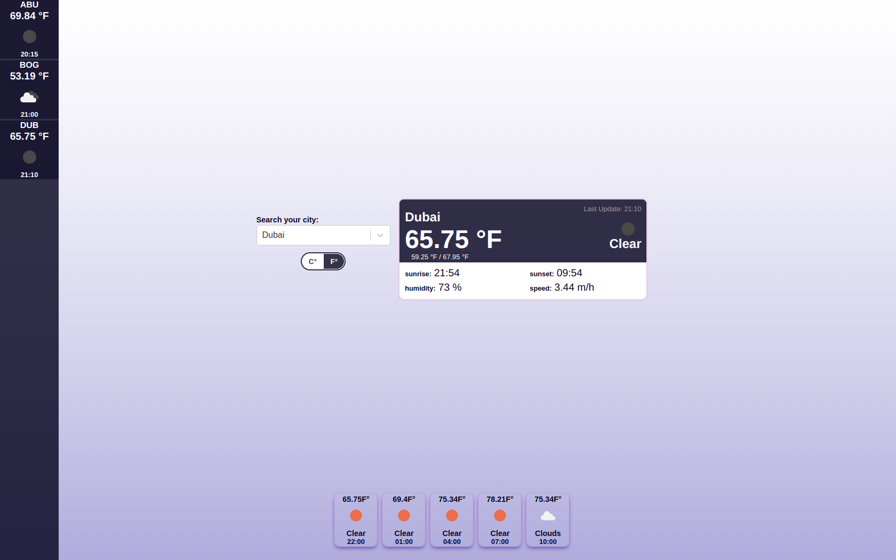

# Weather React App

Weather React App developer with ViteJS, OpenWeatherMap API and GeoDB Cities API

# Local deploy

## Commands

To deploy in dev environment
```
>> npm run dev
```

## Developer tools

This DEMO was developed using the next tools:

- **Front-end tools**
    - ReactJS
    - Redux Toolkit
    - ViteJS
    - Sass
- **API Callbacks**
    - OpenWeatherMap API
    - GeoDB Cities API
- **Other tools**:
    - Axios module

## New features

- Added forecast by searched city within the next 15 hours

## Previews

### Mobile


### Desktop



## Test in public host

For security purpouse about API token's this demo is not available right now in public host as GitHub Pages.

This feature will be implement as soon as possible.


## Authors

- [@mperezs06408](https://github.com/mperezs06408)

